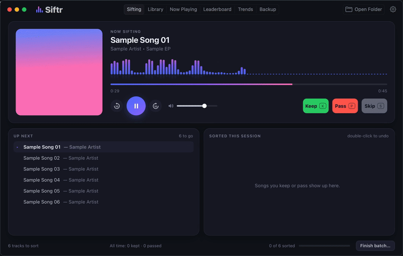
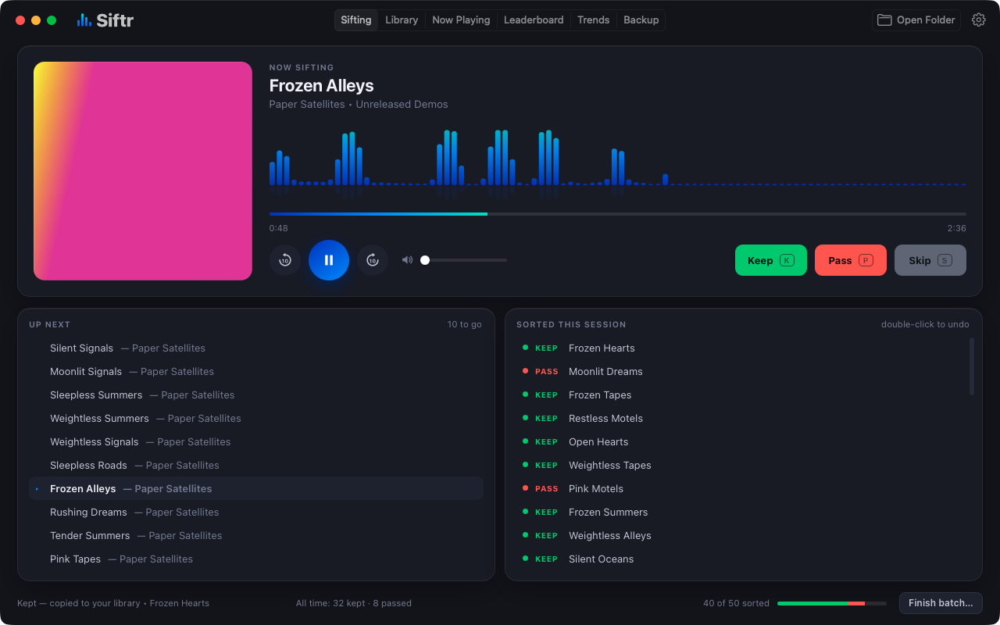
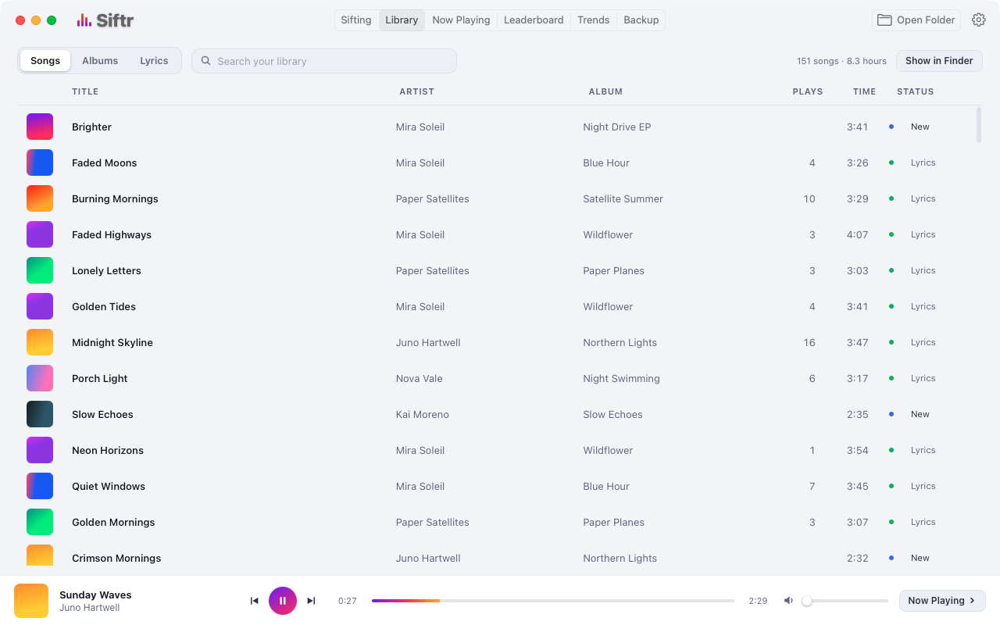
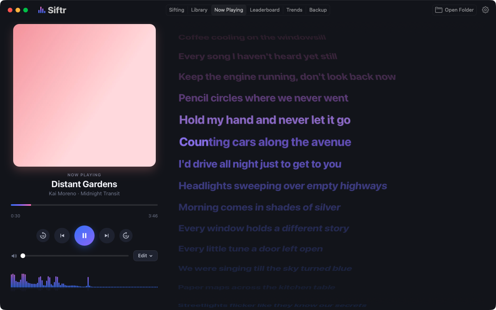
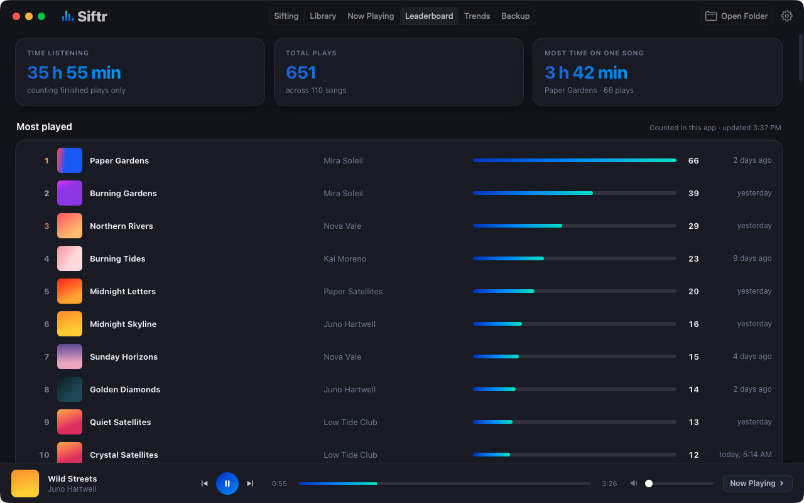

# Siftr

Siftr is a 2 MB Mac app that plays through a folder of new music and lets you Keep, Pass or Skip each song with one key, remembering every decision.

<!-- Demo GIF: replace this line with  -->

## What it does

- **Sort by ear.** Open a folder of new songs and Siftr plays them one by
  one. Press **K** to keep a song (it's copied into your library folder),
  **P** to pass, **S** to skip it for now, **Space** to play or pause. Songs
  you've judged never come up again, so you can stop and pick up later.
- **Your files stay put.** Keeping makes a copy; nothing is moved or deleted.
  When a folder is done, **Finish batch** checks that every kept song is
  safely in your library, then moves the folder to the Trash once you say yes.
- **Library.** Every song you've kept, in one folder: songs, albums, and
  search by a line of the lyrics, even half-remembered.
- **Lyrics.** Now Playing rolls synced lyrics past on a karaoke-style wheel,
  from a song's `.lrc` file or written out on your Mac by OpenAI's Whisper
  model (optional, and downloaded only if you say yes: 646 MB, or 1.6 GB for
  the full model, which is much more accurate on busy songs).
- **Trends.** Most played, heating up and cooling off, forgotten favorites,
  songs you keep skipping, and listening time.
- **Backup and restore.** Copies your library to a thumb drive or external
  disk, in album folders with a playlist, along with Siftr's history. After
  the first time, only new songs are copied. **Restore** puts it all back:
  the songs, and their plays, lyrics and sorting history.

No account, and nothing leaves your Mac except that optional lyrics download.
Every page and shortcut is in [the guide](docs/GUIDE.md).

## Screenshots

| Library | Now Playing | Leaderboard |
|---|---|---|
|  |  |  |

The songs, artists and covers in these pictures are made up for the demo.

## Install

Needs a Mac with Apple Silicon (M1 or later) and macOS 15 Sequoia or later.

1. Download **Siftr.zip** from the [latest release](../../releases/latest),
   open it, and drag **Siftr** into your Applications folder.
2. Open Siftr. The first time, macOS stops it, because Siftr isn't notarized
   by Apple (see [Limits](#limits)): **“Siftr” Not Opened**, *Apple could not
   verify “Siftr” is free of malware that may harm your Mac or compromise your
   privacy.* Click **Done**.
3. Open **System Settings → Privacy & Security** and scroll down to
   **Security**. Next to *“Siftr” was blocked to protect your Mac.*, click
   **Open Anyway** (it shows for about an hour after step 2).
4. macOS asks once more: *Open “Siftr”?* Click **Open Anyway**, and use your
   password or Touch ID if asked.

That's needed only once. To build it yourself instead, see
[docs/DEVELOPMENT.md](docs/DEVELOPMENT.md).

## Numbers

Measured with `scripts/bench.sh` on an M2 MacBook Pro (8 GB, macOS 26), on its
built-in Retina screen with Low Power Mode off, in runs on 25 and 26
September 2026 (the lyrics rows again on the 1.0 build); the ranges cover
them all. Memory is Siftr plus the
parts of macOS's web engine that draw its window. CPU is a share of one core,
as in Activity Monitor, where 100% is one whole core.

| | Memory | CPU |
|---|---|---|
| Nothing playing | 100–104 MB | under 0.5% |
| Sorting a folder, visualizer moving | 145–148 MB | 5.6–6.7% (3.8–5.8% with Calm on) |
| Paused | 110–111 MB | under 0.5% |
| Lyrics rolling | 179–188 MB | 12.4–14.6% (8.3–10.3% with letter-by-letter lighting off) |
| Browsing the library while a song plays | 193 MB | 3.3–4.6% |
| Minimized for 10 minutes, still playing | 103–110 MB | 0.9–1.1% |

The download is 2.2 MB and the installed app 3.7 MB. Moving pictures also
cost macOS's window compositor a little, which isn't in these numbers; the
details, and how each number is measured, are in
[docs/DEVELOPMENT.md](docs/DEVELOPMENT.md).

## Limits

- **Apple Silicon only, macOS 15 or later.** It's tested on macOS 26; macOS
  15 should work but hasn't been tried yet.
- **Not notarized.** macOS asks you to approve it once (Install, steps 2–4).
  It isn't on the Mac App Store and isn't sandboxed.
- **Repeats are recognized by file name and size.** A renamed or re-encoded
  copy of a song you've judged counts as new, and two different songs with
  the same file name and size count as one.
- **One library folder** (subfolders are fine).
- **No streaming services** and no Apple Music connection: Siftr works with
  the music files you have.
- **Whisper can mishear** a word (Now Playing → Edit → Fix a line…), and its
  first start takes a few minutes.
- **Songs over 20 minutes** (long mixes) play and can be sorted, but without
  the visualizer or lyrics. Batches can be as big as you like.
- **OGG files** play on macOS 26 but haven't been checked on macOS 15.

## How it was built

I designed Siftr and directed its build: what it does, how it should feel,
what "light" means, and which trade-offs to make. It was built with
[Claude Code](https://claude.com/claude-code) as my coding partner, and each
change had to pass the tests, plus a before-and-after benchmark for anything
touching speed or memory.

Under the hood: Swift and AppKit for the window and the audio, the screen
drawn by macOS's own web engine, a native Core Animation visualizer, SQLite
for decisions and plays, and Whisper on Apple's Neural Engine through
WhisperKit. 57 unit tests, a self-test that drives the real app, and a
benchmark script: see [docs/DEVELOPMENT.md](docs/DEVELOPMENT.md), and
[CONTRIBUTING.md](CONTRIBUTING.md) to help.

## License

MIT: see [LICENSE](LICENSE). WhisperKit, the one dependency, is MIT too.
